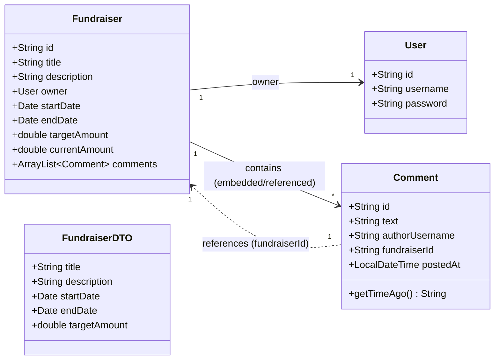

# FundSpark

This is just an extra example using MongoDB and Spring
Don't need to build it together, you can just run though the project and see how it works.

## Run the project

```bash
./mvnw spring-boot:run
```

Look at the OpenAPI docs at `http://localhost:8080/v3/api-docs`.

To run the Svelte frontend:

```bash
cd web-fund-spark
npm i
npm run dev
```

To update the OpenAPI specification, use the following command:

```bash
npx openapi-ts -i http://localhost:8080/v3/api-docs -o src/lib/api
```

## Dependencies

- [Spring Boot]()
- [Validation]() https://www.geeksforgeeks.org/hibernate-validator-with-example/
- [Lombok]()
- [OpenAPI]()
- [Mongodb Data Diver]()

## Database / Model




## Endpoints

## Frontend


