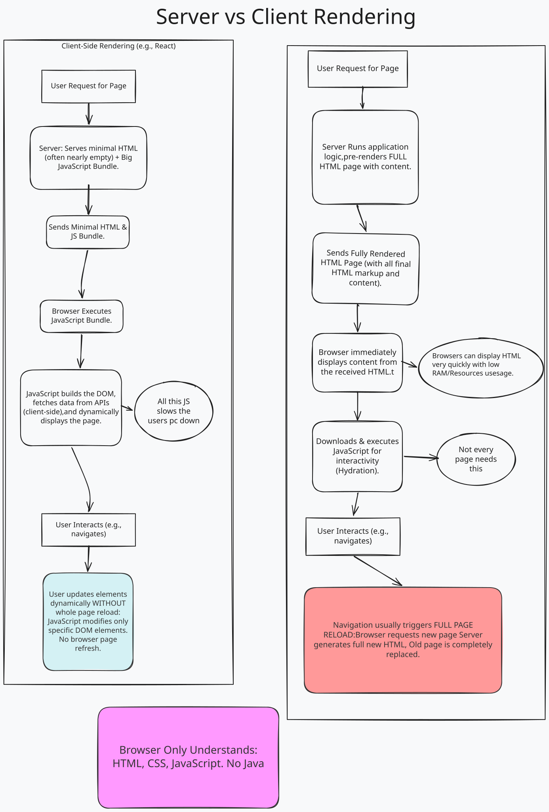
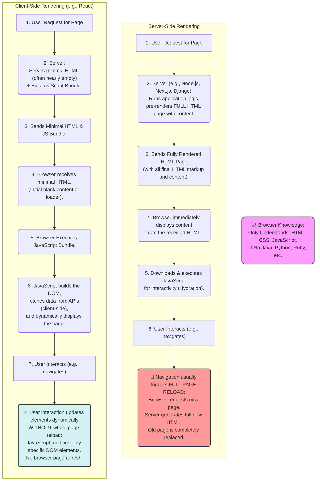

# LU05 L1 Hello Thymeleaf

This is an introduction to Thymeleaf, a modern server-side Java template engine for web and standalone environments.
Follow this guide: https://spring.io/guides/gs/serving-web-content

## Explaining Server-Side Rendering





## Run the Application

```bash
./mvnw spring-boot:run
```

Then open your browser and go to: [http://localhost:8080](http://localhost:8080)
