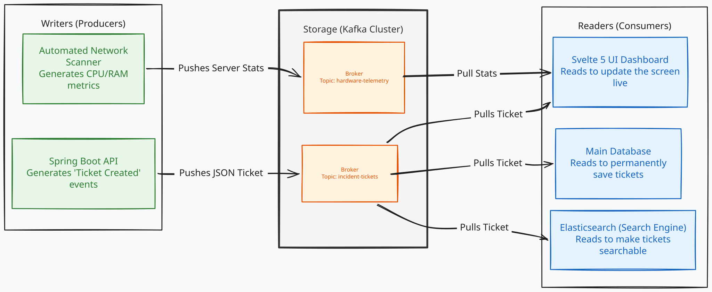

# Intro to Kafka

This lecture we will look at the basics of Kafka, watch a few videos, scroll through the documentation, and then we will set up Kafka on our local machines.

## What is Kafka?

Watch the videos and read the documentation linked in Blackboard.

https://kafka.apache.org/

- [Over 80% of Fortune 100 companies with Apache Kafka](https://kafka.apache.org/powered-by)
- [Popular use cases for event streaming with Apache Kafka](https://kafka.apache.org/uses)
- [Apache Kafka in 10 Minutes YouTube video](https://youtu.be/vHbvbwSEYGo?si=072O_zChafLqhz0L)
- [Getting started with Apache Kafka (high-level concepts)](https://kafka.apache.org/documentation/#gettingStarted)
- [Kafka in 100 Seconds](https://www.youtube.com/watch?v=uvb00oaa3k8)



## Installation

Use this docker image: https://hub.docker.com/r/apache/kafka/tags

Use the [docker-compose.yml](docker-compose.yml) file to set up Kafka and Zookeeper. You can run the following command to start the services:

```bash
# Start the services
docker compose up -d
# Check the status of the services
docker compose ps
```

## Test the Kafka Cluster

In the following commands, we will create a topic, start a producer to write messages to the topic, and start a consumer to read messages from the topic.

```bash
# Create a topic
docker exec -it kafka /opt/kafka/bin/kafka-topics.sh \
  --bootstrap-server localhost:9092 \
  --create \
  --topic test-topic \
  --partitions 1 \
  --replication-factor 1

# Start a producer (Write messages to the topic)
# Then write a message, ctrl-c to finish
docker exec -it kafka /opt/kafka/bin/kafka-console-producer.sh \
  --bootstrap-server localhost:9092 \
  --topic test-topic

# Start a consumer (Read messages from the topic)
# ctrl-c to stop listening
docker exec -it kafka /opt/kafka/bin/kafka-console-consumer.sh \
  --bootstrap-server localhost:9092 \
  --topic test-topic \
  --from-beginning
```

> Stop the container with `docker compose down` when you are done testing.

## Kafka UI

You can view your Kafka "Database" with the built in UI. Open a browser and go to [`http://localhost:8010/`](http://localhost:8010/). You can view topics and messages

<!-- Apache Kafka needs to be running locally for any of our examples to work. 
To run an Apache Kafka docker container that exposes ports for external applications to use, use this docker run command:

docker run -d -p 9092:9092 --name broker apache/kafka:latest

The important part here is that it is forwarding traffic from the internal 9092 port to your local 9092 port. You can change the name of the container or use a different Kafka image version as needed. -->
