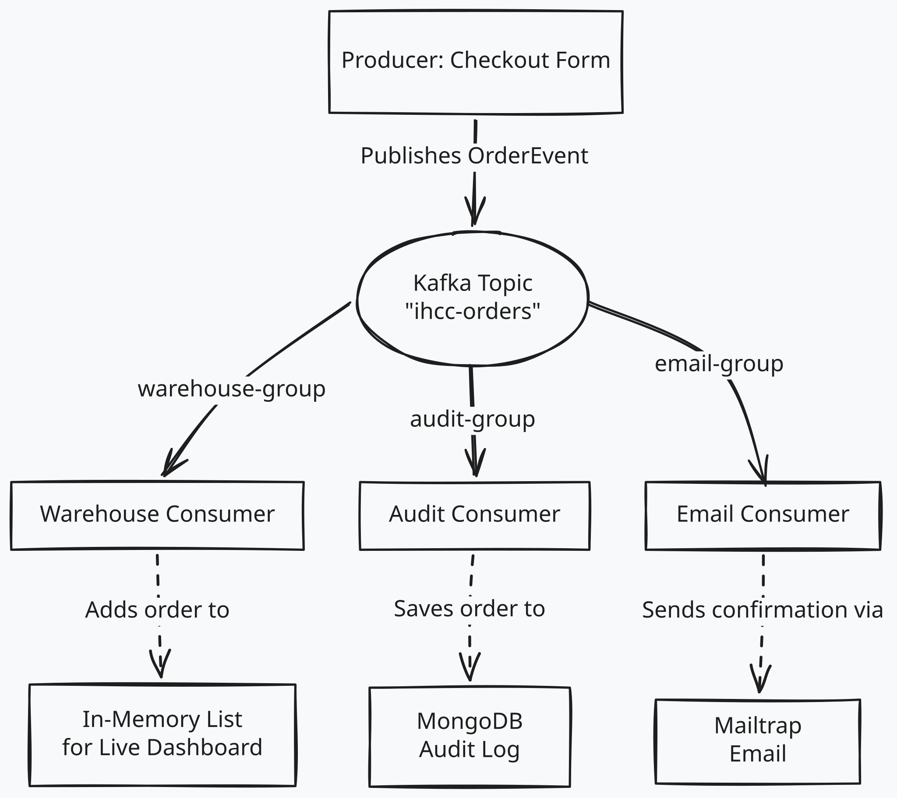

# L4 E-Commerce

## Create the Project

Using the [Spring Initializr](https://start.spring.io/), create a new Maven project with the following settings:

- Project Name: `ihcc-ecommerce`
- Dependencies:
    - Spring Web
    - Spring for Apache Kafka
    - Spring Boot DevTools
    - Lombok
    - Thymeleaf
    - Validation
    - Spring Data MongoDB
    - Java Mail Sender
    - Gson (Added manually to `pom.xml`)

[Or use this link to pre-configure the project](https://start.spring.io/#!type=maven-project&language=java&platformVersion=4.1.0&packaging=jar&configurationFileFormat=properties&jvmVersion=25&groupId=com.example&artifactId=commerce&packageName=com.example.commerce&dependencies=web,kafka,devtools,lombok,thymeleaf,validation,mail,data-mongodb)

## Consumers and Producer Diagram



## Building the Application

- Use the Starter code from Blackboard to build the application.
    - Starter includes Model package, and HTML templates.
- Build the Controller
- Build the Consumer
- Configure the application properties for Kafka, MongoDB, and Mailtrap.

This project uses [Mailtrap](https://mailtrap.io/) to simulate sending emails.
You can send up to 4,000 emails per month for free.
After creating the account, go to the sandbox and get your username and password to use in the `.env` file.

## Running the Application

Make sure the Kafka server is running. In the directory of the docker compose file, run the following command to start the Kafka server:

```bash
docker compose up -d
```

> Also Mongodb needs to be running.

Start the application with the following command in the project directory:

```bash
./mvnw spring-boot:run
```

Visit `http://localhost:8080` to see the form.
You can use any fake email.
Submit an order and watch the three consumers react to the single event.

Also check:

- The Kafka topic on `http://localhost:8010`.
- The MongoDB database to see the saved orders.
